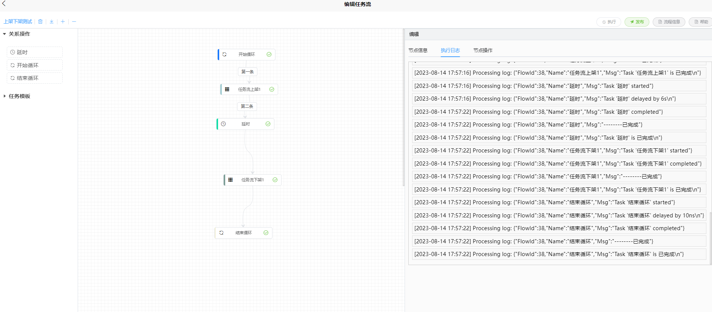

<h1 align="center">🎊🥂 Welcome to kv-flow 👋</h1>
<p>
  

> 一个dag任务流设计框架

## 📅 功能计划（规划）

* 样式优化
* 执行任务流

## 开发日志

* 增加了前后端对接后端使用go,基于kv-services开发,后面开发结束后开源
* 增加了执行日志
* 增加了循环节点以及延时节点
* 优化了布局以及样式
* 基于BiaoChengLiu的easy-flow进行改进https://github.com/BiaoChengLiu/easy-flow

### ✨ [kv-services 文档地址/问题记录](http://doc.kv-iot.cn/)

### 后端开源地址

* 暂无

## 🪄 Install 如何运行

### 开发方式运行

```sh
npm i
npm run serve
```

### 项目截图



### 基于此项目开发

<a href="https://github.com/BiaoChengLiu/easy-flow">

</a>

https://github.com/BiaoChengLiu/easy-flow

## Author

👤 **jobs_vivi**

* Twitter: [@jobsvivi](https://twitter.com/jobsvivi)
* Github: [@kissvivi](https://github.com/kissvivi)

## Show your support

Give a ⭐️ if this project helped you!

## Thanks 感谢赞助

<a href="https://jb.gg/OpenSourceSupport">

</a>

## 📝 License

---
